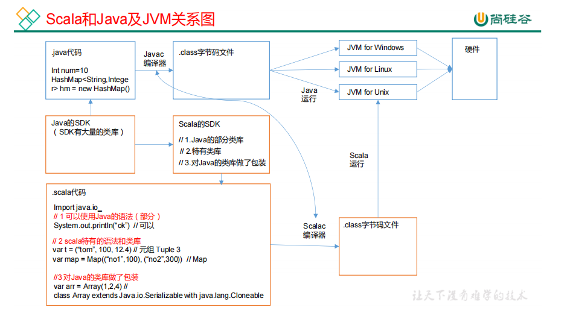
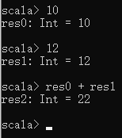
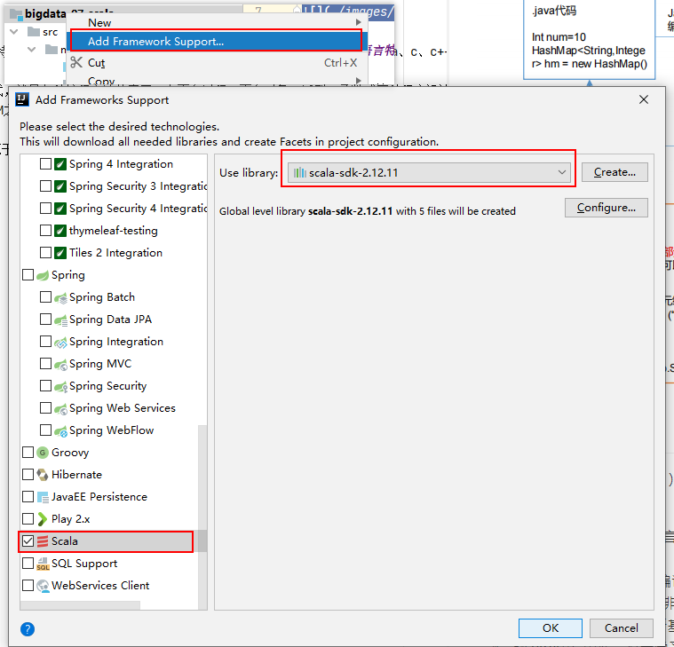
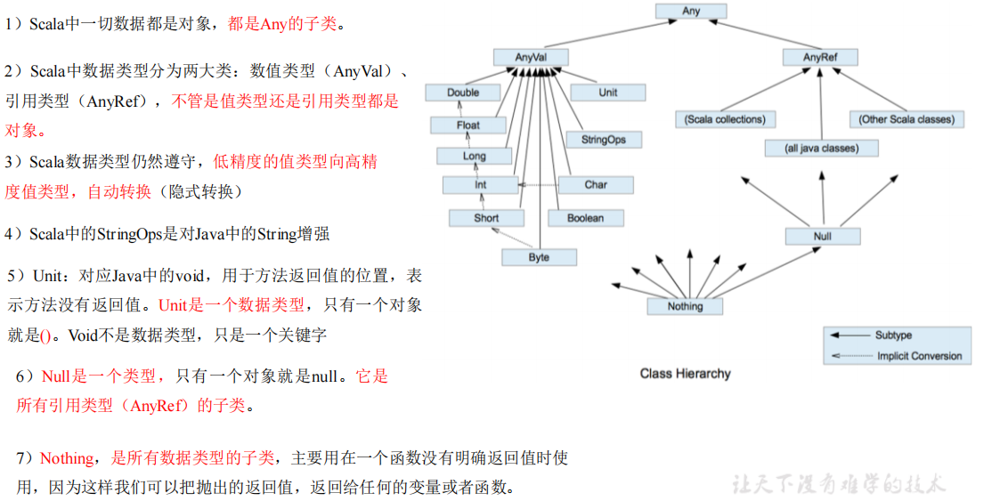
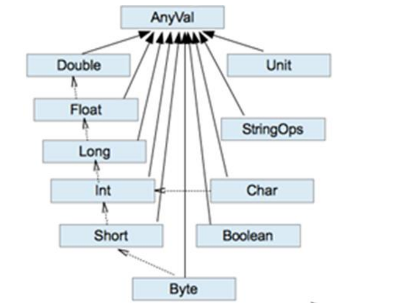

# Scala简介

## Scala和Java关系

一般来说，学 Scala 的人，都会 Java，而 Scala 是基于 Java 的，因此我们需要将 Scala和 Java 以及 JVM 之间的关系搞清楚，否则学习 Scala 你会蒙圈。



## Scala语言特点

Scala是一门以Java虚拟机（JVM）为运行环境并将面向对象和函数式编程的最佳特性结合在一起的静态类型编程语言（静态语言需要提前编译的如：Java、c、c++等，动态语言如：js）。 

1. Scala是一门多范式的编程语言，Scala支持面向对象和函数式编程。（多范式，就是多种编程方法的意思。有面向过程、面向对象、泛型、函数式四种程序设计方法。） 
2. Scala源代码（.scala）会被编译成Java字节码（.class），然后运行于JVM之上，并可以调用现有的Java类库，实现两种语言的无缝对接。
3. Scala单作为一门语言来看，非常的简洁高效**。**
4. Scala在设计时，马丁·奥德斯基是参考了Java的设计思想，可以说Scala是源于Java，同时马丁·奥德斯基也加入了自己的思想，将函数式编程语言的特点融合到JAVA中, 因此，对于学习过Java的同学，只要在学习Scala的过程中，搞清楚Scala和Java相同点和不同点，就可以快速的掌握Scala这门语言。

# Scala环境搭建

1. JDK1.8环境

2. 解压scala压缩包

3. 配置环境变量 SCALA_HOME和PATH (不能有中文路径)

4. 测试

   

# Idea对Scala支持

1. 创建一个java项目

2. 安装scala插件

3. 添加框架支持

   

4. 创建scala文件夹并添加至resource root

# 入门Demo

## Hello World

```scala
package top.damoncai.scala.chapter01

/**
 * object：关键字，声明一个单例对象(伴生对象)
 */
object Demo_01_HelloWorld {

  /**
   * mian 方法：外部可执行的方法
   * def 方法名称(参数名：参数类型)：返回数据类型 = {方法体}
   * @param args
   */
  def main(args: Array[String]): Unit = {
    println("Hello World");
    println(Math.max(10,12)); // 调用java代码
  }
}
```

## 伴生类和伴生对象

```scala
package top.damoncai.scala.chapter02


class Student (name:String,age:Int) {

  def printInfo(): Unit = {
    println(name + " - " + age + " - " + Student.school);
  }
}


// 引入伴生对象
object Student {
  val school:String = "mashibing";

  def main(args: Array[String]): Unit = {
   val stu = new Student("张三",12);
    stu.printInfo();
  }
}
```

# 引入源码

# 变量和数据类型

## 变量和常量

1. Java 变量和常量语法

   ```java
   变量类型 变量名称 = 初始值 int a = 10
   final 常量类型 常量名称 = 初始值 final int b = 20
   ```

2. scala

   ```scals
   var 变量名 [: 变量类型] = 初始值 var i:Int = 10
   val 常量名 [: 常量类型] = 初始值 val j:Int = 20
   注意：能用常量的地方不用变量
   ```

**注意**

1. 声明变量时，类型可以省略，编译器自动推导，即类型推导
2. 类型确定后，就不能修改，说明 Scala 是强数据类型语言
3. 变量声明时，必须要有初始值
4. 在声明/定义一个变量时，可以使用 var 或者 val 来修饰，var 修饰的变量可改变

## 标识符

Scala 对各种变量、方法、函数等命名时使用的字符序列称为标识符。即：凡是自己可以起名字的地方都叫标识符。

1. 以字母或者下划线开头，后接字母、数字、下划线
2. 以操作符开头，且只包含操作符（+ - * / # !等）
3. 用反引号`....`包括的任意字符串，即使是 Scala 关键字（39 个）也可以

## 字符串输出

1. 字符串，通过+号连接
2. printf 用法：字符串，通过%传值
3. 字符串模板（插值字符串）：通过$获取变量值 

## 标准输入

​	StdIn.readLine()、StdIn.readShort()、StdIn.readDouble()

## Scala数据类型



## 整数类型（Byte、Short、Int、Long）

| **数据类型** | **描述**                                                     |
| ------------ | ------------------------------------------------------------ |
| Byte [1]     | 8 位有符号补码整数。数值区间为 -128 到 127                   |
| Short [2]    | 16 位有符号补码整数。数值区间为 -32768 到 32767              |
| Int [4]      | 32 位有符号补码整数。数值区间为 -2147483648 到 2147483647    |
| Long [8]     | 64 位有符号补码整数。数值区间为 -9223372036854775808 到9223372036854775807 = 2 的(64-1)次方-1 |

## 字符类型Char

1. 字符常量是用单引号 ' ' 括起来的单个字符。
2. \t ：一个制表位，实现对齐的功能
3. \n ：换行符

## 布尔类型 Boolean

1. 布尔类型也叫 Boolean 类型，Booolean 类型数据只允许取值 true 和 false
2. boolean 类型占 1 个字节

## Unit类型、Null类型和Nothing类型

| **数据类型** | **描述**                                                     |
| ------------ | ------------------------------------------------------------ |
| **Unit**     | 表示无值，和其他语言中 void 等同。用作不返回任何结果的方法的结果，类型。Unit 只有一个实例值，写成()。 |
| **Null**     | null , Null 类型只有一个实例值 null                          |
| **Nothing**  | Nothing 类型在 Scala 的类层级最低端；它是任何其他类型的子类型。当一个函数，我们确定没有正常的返回值，可以用 Nothing 来指定返回类型，这样有一个好处，就是我们可以把返回的值（异常）赋给其它的函数或者变量（兼容性） |

## 类型转化

### 自动类型转换

当 Scala 程序在进行赋值或者运算时，精度小的类型自动转换为精度大的数值类型，这个就是自动类型转换（隐式转换）。数据类型按精度（容量）大小排序为：



1. 自动提升原则：有多种类型的数据混合运算时，系统首先自动将所有数据转换成精度大的那种数据类型，然后再进行计算。
2. 把精度大的数值类型赋值给精度小的数值类型时，就会报错，反之就会进行自动类型转换。
3. （byte，short）和 char 之间不会相互自动转换。
4. byte，short，char 他们三者可以计算，在计算时首先转换为 int 类型。 

### 强制类型转换

自动类型转换的逆过程，将精度大的数值类型转换为精度小的数值类型。使用时要加上强制转函数，但可能造成精度降低或溢出，格外要注意

1. 将数据由高精度转换为低精度，就需要使用到强制转换
2. 强转符号只针对于最近的操作数有效，往往会使用小括号提升优先级

### 数字类型和String类型转换

1. 基本类型转 String 类型（语法：将基本类型的值+"" 即可）
2. String 类型转基本数值类型（语法：s1.toInt、s1.toFloat、s1.toDouble、s1.toByte、s1.toLong、s1.toShort）

# 运算符

## 算术运算符

```scala
object TestArithmetic {
 def main(args: Array[String]): Unit = {
 //（1）对于除号“/”，它的整数除和小数除是有区别的：整数之间做除法时，只保留整数部分而舍弃小数部分。
 var r1: Int = 10 / 3 // 3
 println("r1=" + r1)
 var r2: Double = 10 / 3 // 3.0
 println("r2=" + r2)
 var r3: Double = 10.0 / 3 // 3.3333
 println("r3=" + r3)
 println("r3=" + r3.formatted("%.2f")) // 含义：保留小数点 2位，使用四舍五入
```


## 关系运算符(比较运算符)

```scala
def main(args: Array[String]): Unit = {
    val st1:String = "hello"

    val st2:String = new String("hello");

    println(st1 == st2)
    println(st1.equals(st2))
    println(st1.eq(st2)) // scala中表示比较内存地址
  }
```

## 逻辑运算符

## 赋值运算符

**注意：**Scala 中没有++、--操作符，可以通过+=、-=来实现同样的效果；

## 位运算

## Scala运算符本质

在 Scala 中其实是没有运算符的，所有运算符都是方法。

1. 当调用对象的方法时，点.可以省略

2. 如果函数参数只有一个，或者没有参数，()可以省略

   ```scala
   object TestOpt {
    def main(args: Array[String]): Unit = {
    // 标准的加法运算
    val i:Int = 1.+(1)
    // （1）当调用对象的方法时，.可以省略
    val j:Int = 1 + (1)
    // （2）如果函数参数只有一个，或者没有参数，()可以省略
    val k:Int = 1 + 1
    
    println(1.toString())
    println(1 toString())
    println(1 toString)
    }
   }
   ```

# 流程控制

## if ... else if ... else

Scala 中 if else 表达式其实是有返回值的，具体返回值取决于满足条件的代码体的最后一行内容。

```scala
 def main(args: Array[String]): Unit = {

    println("=======================  if返回值  =======================")
    var age = 10;

    // any也可以省略
    var res1:Any = if(age > 18) {
      "成年人"
    }else if(age == 18) {
      "刚成年"
    }else{
      17
    }
    println(res1)

    println("=======================  if三元运算  =======================")

    var res2 = if( age > 18) "成年人" else "17"
    println(res2)
  }
}
```

## For循环

 ### 范围遍历 TO

### 范围遍历 Until

即使前闭合后开的范围

### 集合遍历

### 循环守卫

```scala
println("=======================  循环守卫  =======================")
    for(i <- 1 until 5 if i != 3) {
      println(i)
    }
```

### 步长

```scala
println("=======================  步长  =======================")
    for(i <- 1 to 10 by 2) {
      println(i)
    }

    println("=======================  步长 - reverse  =======================")
    for(i <- 1 to 10 by 2 reverse) {
      println(i)
    }

    println("=======================  步长 - 负数  =======================")
    for(i <- 10 to 1 by -2) {
      println(i)
    }
```

### 循环嵌套

```scala
  println("=======================  嵌套循环  =======================")
    for (i <- 1 to 4) {
      for (j <- 1 to 5) {
        println("i=" + i + ",j=" + j)
      }
    }

    println("=======================  嵌套循环  =======================")
    for (i <- 1 to 4; j <- 1 to 5) {
      println("i=" + i + ",j=" + j)
    }
```

### 引入变量

```scala
 println("=======================  引入变量  =======================")
    for (i <- 1 to 4; j = 4 -i) {
      println("i=" + i + ",j=" + j)
    }

    println("=======================  引入变量 2  =======================")
    for {
      i <- 1 to 4;
      j = 4 -i
    }
    {
      println("i=" + i + ",j=" + j)
    }
```

